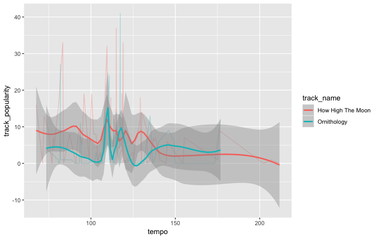

# Computational Musicology 2019
## Analysing Ornithology

I will be analysing to the jazz standard Ornithology, first recorded by Charlie Parker. Ornithology is a refference to Parkers nickname "Bird". Jazz standards often differ from one another quite alot, yet Ornithology is one among them that is particularly well known for all the different recordings. 
One reason for this is that the jazz standard has also been recorded under another name "How high the Moon", which follows the exact same chord progression as ornithology, but is usually in a slower tempo. Because of this tempo is one of the first aspects which come to mind for analysing this standard. Obviously, some Ornithology recordings are going to be slower than some How high the moon recordings. 

The data I am using is playlist containing ±90 How High The Moon recordings, and ±90 Ornithology recordings. This Histogram shows us that what I previously stated, is not actually validated by my data. It appears that there is little difference at all in tempo between the recordings labled "How High The Moon" and "Ornithology".

tempo hhtm vs O

artists vs tempo

artists vs pop.

tempo vs pop

I've created a playlist in which I have, up til now, added 92 Ornithology recordings. 
After getting the features of these recordings, one of the first things you can see is that there is a vast difference in popularity ranging from 0 to 40. As a refference, disneys own popular songs playlist has a popularity range of 13-74. 
As I was expecting beforehand, the tempo also is a field in which there is a lot of difference. The slowest tempo at 73, and the fastest as 176. These are just a couple of fields where all of these recordings differ in, some recordings are even in a minor key, as apposed to a more usual major key. Interestingly there are two definate outliers in duration of the recording. all recordings lie between 141507ms and 668240ms, yet there is one recording of only 43147ms which is a different order of magnitude, and 4 times slower then the next slowest. The other outlier is a duration of 926333ms, which is 1/3 times longer then the next longest. The median duration is 314720ms. So I do consicer the above mentioned durations as outliers. 

-----------------------------------------homework assignment copied from canvas-----------------------------------------------

Enrich your findings from last week with one or more data visualisations – including tables, if desired – and incorporate these visualisations into your text. Where these visualisations suggest new findings or patterns, discuss them. 

Focus on the quality of the visualisations rather than quantity. In particular, consider some of Tufte’s classical design principles.

Have you maximised the amount of data displayed in your visualisation, making full use of ggplot tools like colour, fill, faceting, and text labels for outliers?
Have you reduced extraneous ‘chart junk’ as much as possible, for example, by replacing legends with text labels and making thoughtful choices about the axis limits and labels?
Does your visualisation have a clear story to tell that invokes curiosity about your research question?
Submit the URL to your new web page for peer review.

