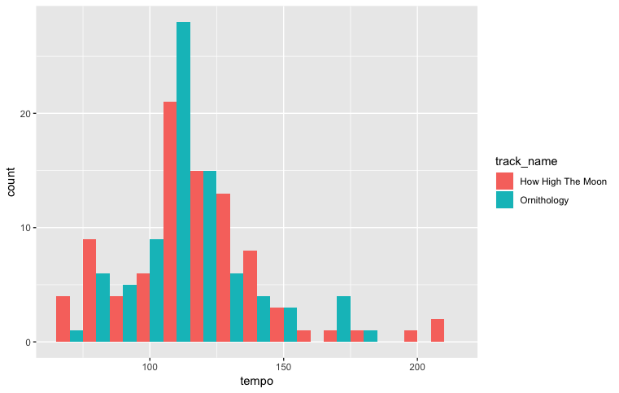
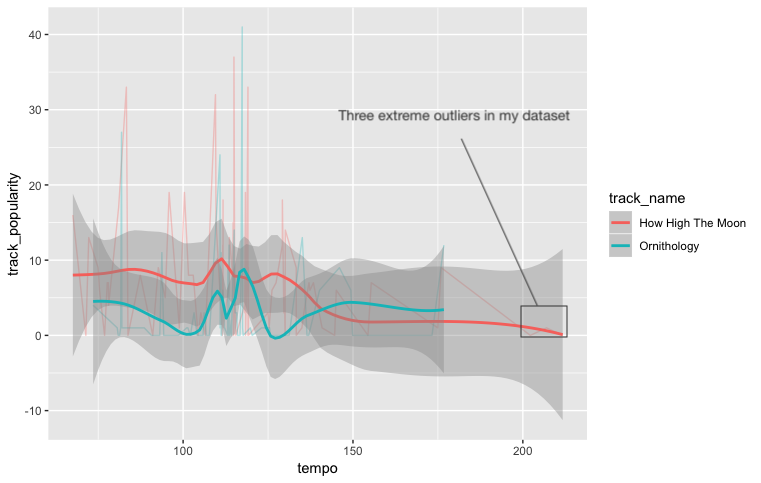

!!!!!!!!!!!

For my peer reviewers. For some apparent reason my flexdashboard will not link to this page. I have no idea what is going wrong, and am still awaiting Ashley's return email.

!!!!!!!!!!!

# Computational Musicology 2019
## Analysing Ornithology

I will be analysing to the jazz standard Ornithology, first recorded by Charlie Parker. Ornithology is a refference to Parkers nickname "Bird". Jazz standards often differ from one another quite alot, yet Ornithology is one among them that is particularly well known for all the different recordings. 
One reason for this is that the jazz standard has also been recorded under another name "How high the Moon", which follows the exact same chord progression as ornithology, but is usually in a slower tempo. Because of this tempo is one of the first aspects which come to mind for analysing this standard. Obviously, some Ornithology recordings are going to be slower than some How high the moon recordings. 

This Histogram shows us that what I previously stated, is not actually validated by my data. It appears that there is little difference at all in tempo between the recordings labled "How High The Moon" and "Ornithology". There are even a couple of How High The Moon recordings, way faster then any other Ornithology recording in my dataset. The data I am using is a playlist containing ±90 How High The Moon recordings, and ±90 Ornithology recordings. 

Besides tempo differences, one of the things that I noticed immediately, is that there is a vast difference in popularity ranging from 0 to 41. Which is quite a lot, seeing it is all actually the same song. As a refference for popularity, disneys own popular songs playlist has a popularity range of 13-74, yet in a playlist of 10X top1 disney song, the popularity is pretty much the same.
I am going to try to find an explanation for this huge popularity range by plotting it against a set of different possible causes. If a perfect correlation is found I would expect to see a graph where 'popularity vs x' gives me an straight diagonal line (y=B * x). I am not expecting to find such a perfect correlation however, as popularity will most likely be a combination of factors. 

The first obvious step is to plot popularity against tempo. 

This graph shows us a couple of interesting things. Most importantly, it shows us that there is a definite sweet spot in tempo, where the recordings are more popular. This occurs for both How High The Moon and Ornithology around 115BPM. At a slower tempo of 80BPM another spike in popularity is seen, telling us that this song is also enjoyed at a slower tempo. Another thing we can easily see from this graph is that the three extremely fast recordings of how High The Moon, already mentioned in below the previous histogram, are definately outliers in my dataset. 

There are many more ways to find some correlation for popularity. In the comming weeks I will be exploring those.

  
-------
 
notes and doodle space for me:

Interestingly there are two definate outliers in duration of the recording. all recordings lie between 141507ms and 668240ms, yet there is one recording of only 43147ms which is a different order of magnitude, and 4 times slower then the next slowest. The other outlier is a duration of 926333ms, which is 1/3 times longer then the next longest. The median duration is 314720ms. So I do consicer the above mentioned durations as outliers. 

tempo hhtm vs O

artists vs tempo

artists vs pop.

tempo vs pop

-----------------------------------------homework assignment copied from canvas-----------------------------------------------

Enrich your findings from last week with one or more data visualisations – including tables, if desired – and incorporate these visualisations into your text. Where these visualisations suggest new findings or patterns, discuss them. 

Focus on the quality of the visualisations rather than quantity. In particular, consider some of Tufte’s classical design principles.

Have you maximised the amount of data displayed in your visualisation, making full use of ggplot tools like colour, fill, faceting, and text labels for outliers?
Have you reduced extraneous ‘chart junk’ as much as possible, for example, by replacing legends with text labels and making thoughtful choices about the axis limits and labels?
Does your visualisation have a clear story to tell that invokes curiosity about your research question?
Submit the URL to your new web page for peer review.

