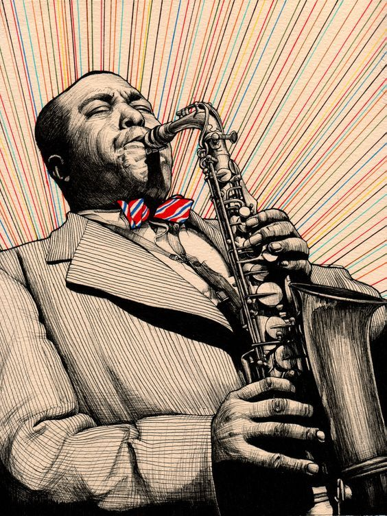
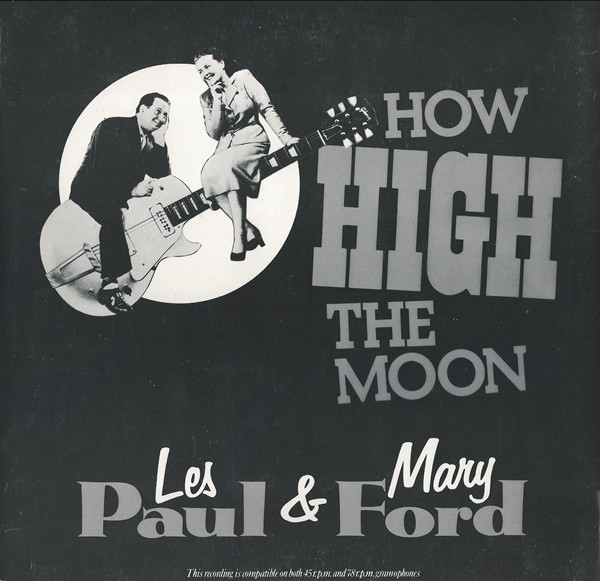

`r knitr::opts_chunk$set(cache = TRUE)`

```{r, cache = FALSE}
# In order to use these packages, we need to install flexdashboard, plotly, and Cairo.
library(tidyverse)
library(tidymodels)
library(plotly)
library(spotifyr)
library(compmus)


source('spotify.R')
```

### Indtroduction

 

***

I will be analysing to the jazz standard Ornithology, first recorded by Charlie Parker. Ornithology is a refference to Parkers nickname "Bird". Jazz standards often differ from one another quite alot, yet Ornithology is one among them that is particularly well known for all the different recordings. One reason for this is that the jazz standard has also been recorded under another name "How high the Moon", which follows the exact same chord progression as Ornithology, but is usually in a slower tempo and follows a somewhat different melody. In essence though both 'titles' are the exact same jazz piece    

I want to know if there are any real measurable differences in recordings under the name How High the moon and Ornithology. What makes some musicians name the recording how they do. Are there actually some aspects that differ causing the different name, or is this an arbitrary prefference of the musicians, and are the names really interchangable. In order to get Find out if there are any differences I created a playlist containing ±100 How High The Moon recordings, and ±100 Ornithology recordings. 


### Visualisation of Tempo in 'Ornithology' and 'How High the moon;


```{r}
ornithology <- get_playlist_audio_features("1115668083", "3pMfdAOvErb9AEnAO9W2fa")
ggplot(ornithology, aes(x=tempo, fill=track_name)) + geom_histogram(position='dodge', binwidth = 15, alpha=0.7)

```


***

One of the first distiguishable features might be the tempo. As I stated earlier I believed that How high the Moon (HHTM) recordings usually were recorded in a slower tempo than Ornithology (OTHGY) recordings. However, this is not backed up by my findings.

On the left you will see a histogram the temp of all the recordings I added to my playlist. As You can see there are acctually no real differences in tempo between the recordings. Most recodings seem to cluster around 120 bpm. Yet my statement might not be completely untrue, as there are, just marginally, more slow HHTM recordings.

### Popularity vs Tempo.


```{r}
ggplot(ornithology, aes(x=tempo, y=track_popularity, color=track_name)) + geom_line(alpha=0.3) + geom_smooth(span=0.4)
```


***

It might be that the dataset I created, happened to only include unusually fast HHTM recordings. To check if this is the case, then the popularity of the faster HHTM tracks must be less then the popularity of the slower recordings of HHTM. Here we see the popularity versus the tempo for both titles. 

This graph shows us that my dataset does not consist of outlier recordings of HHTM, as the popularity of all different tempos of HHTM recordings relates well to the same tempo OTHGY recordings. Further more this graph tells us that there is a definite sweet spot in tempo, where the recordings are more popular. This occurs for both How High The Moon and Ornithology around 115BPM. At a slower tempo of 80BPM another spike in popularity is seen, telling us that this song, in both titles, is also enjoyed at a slower tempo. What is interesting to see is that eve though the original recording was titled Ornithology, the How high the Moon recordings seem to be more popular overal. Another thing we can easily see from this graph is that the three extremely fast recordings of how High The Moon are definately outliers in my dataset.


### similarity matrix and relation between most pupular hhtm and ornithology..

```{r}
orni_maxPop <- 
    get_tidy_audio_analysis('6A1mh31895sUIYEpOfeqC3') %>% 
    select(segments) %>% unnest(segments) %>% 
    select(start, duration, pitches)
hhtm_maxPop <- 
    get_tidy_audio_analysis('5ldNRCiBHlFlBlvJmDMlCn') %>% 
    select(segments) %>% unnest(segments) %>% 
    select(start, duration, pitches)

song_dist <- 
    compmus_long_distance(
    orni_maxPop %>% mutate(pitches = map(pitches, compmus_normalise, 'manhattan')),
    hhtm_maxPop %>% mutate(pitches = map(pitches, compmus_normalise, 'manhattan')),
    feature = pitches,
    method = 'aitchison')
```

```{r}
maria <- 
    song_dist %>% 
    mutate(
        orni_maxPop = xstart + xduration / 2, 
        hhtm_maxPop = ystart + yduration / 2) %>% 
    ggplot(
        aes(
            x = orni_maxPop,
            y = hhtm_maxPop,
            fill = d)) + 
    geom_tile(aes(width = xduration, height = yduration)) +
    coord_fixed() +
    scale_x_continuous(


        ) +
    scale_y_continuous(

  
        ) +
    scale_fill_viridis_c(option = 'E', guide = "none") +
    theme_classic() + 
    theme(axis.text.x = element_text(angle = 30, hjust = 1)) +
    labs(x = 'Ornithologys', y = 'How high the moon')
# ggsave('maria.png', maria, width = 13, height = 8, dpi = 'retina')
maria
```

***
As you can see these recordings dont seem to be very similar pitch wise according to this similarity matrix...

Even though both tracks are in the same key, and folow the same chord scheme there does not seem to be a lot of similarity. An explenation for this is improvisation. Both pieces might be folowing the exact same scheme, but the musicians improvisation appears to make the recordings inheritly different. At least so viewing from a similarity matrix. We can try and view both structures by making selfsimilarity matrices. 


### Ornithology: self-similarity matrices for pitch and chroma.

```{r}
orniSS <- 
    get_tidy_audio_analysis('6A1mh31895sUIYEpOfeqC3') %>%
    compmus_align(bars, segments) %>% 
    select(bars) %>% unnest(bars) %>% 
    mutate(
        pitches = 
            map(segments, 
                compmus_summarise, pitches, 
                method = 'acentre', norm = 'manhattan')) %>% 
    mutate(
        timbre = 
            map(segments, 
                compmus_summarise, timbre, 
                method = 'mean'))
bztplot <- 
    bind_rows(
        orniSS %>% compmus_self_similarity(pitches, 'aitchison') %>% mutate(d = d / max(d), type = "Chroma"),
        orniSS %>% compmus_self_similarity(timbre, 'euclidean') %>% mutate(d = d / max(d), type = "Timbre")) %>% 
    ggplot(
        aes(
            x = xstart + xduration / 2, 
            width = xduration,
            y = ystart + yduration / 2,
            height = yduration,
            fill = d)) + 
    geom_tile() +
    coord_fixed() +
    facet_wrap(~ type) +
    scale_fill_viridis_c(option = 'E', guide = 'none') +
    theme_classic() +
    labs(x = '', y = '')
ggplotly(bztplot)
```

***
In these two matrices you can see that there is definately a structure within the complex improvisation. It is not per see any recurring patterns which make me conclude this - the whole point of improvisation being that you play around with tempo, pitch and timbre - but it is the clear 'new' unplayed parts. The vertical yellow lines (chroma) mean that from there on a new part of the standard is played. So even though the musician is doing all kinds of complicated improvisation, the structure of the standard can be followed. If I am correct, the recordings of high how the moon should show somewhat similar paterns. However, we might see some difference, which might point to why some recordings are names Ornithology, and others How High the moon.


### How high the moon: self-similarity matrices for pitch and chroma.

```{r}
hhtmSS <- 
    get_tidy_audio_analysis('5ldNRCiBHlFlBlvJmDMlCn') %>%
    compmus_align(bars, segments) %>% 
    select(bars) %>% unnest(bars) %>% 
    mutate(
        pitches = 
            map(segments, 
                compmus_summarise, pitches, 
                method = 'acentre', norm = 'manhattan')) %>% 
    mutate(
        timbre = 
            map(segments, 
                compmus_summarise, timbre, 
                method = 'mean'))
bztplot <- 
    bind_rows(
        hhtmSS %>% compmus_self_similarity(pitches, 'aitchison') %>% mutate(d = d / max(d), type = "Chroma"),
        hhtmSS %>% compmus_self_similarity(timbre, 'euclidean') %>% mutate(d = d / max(d), type = "Timbre")) %>% 
    ggplot(
        aes(
            x = xstart + xduration / 2, 
            width = xduration,
            y = ystart + yduration / 2,
            height = yduration,
            fill = d)) + 
    geom_tile() +
    coord_fixed() +
    facet_wrap(~ type) +
    scale_fill_viridis_c(option = 'E', guide = 'none') +
    theme_classic() +
    labs(x = '', y = '')
ggplotly(bztplot)
```

***
In the chroma matrix we can indeed see vertical yellow lines in the same places as in Ornithology. Though it also seems to be that there is less imporovising in this recording (less yellow overall). In the Timbre matrix we see an interesting pattern. It seems like the recordings starts out with a clear(ish) theme, then does a lot of improvisation and ends with the theme again. The second time the theme is played, it is not a complete duplicate of the first time, it does still seem to have some nice improvisational quality to it. A structure like this seems very plausible to me in jazz. This however is not a structure we see in any of the other matrices (chroma and timbre) of this recording and the Ornithology recording. This might actually be one of the crucial differences between the two titles.

### scatterplot energy v valence

```{r}
ggplot(ornithology, aes(x=valence, y=energy, color=track_name, size=track_popularity)) + geom_point(alpha=0.6)
```


***
From the previous similarity matrices, it is hard to make hard conclusions about what makes one recording be named so, and another different. So back to a more basic representation. On the left we see a scatterplot of valencee v energy, size is here the popularity. What we can see from this, is that for a large part, the songs overlap completely. Yet in the left bottom corner, with low energy and low valence we see only How high the moon recordings. Finnaly an aspect in which the titles really do differ. One might also argue that top left, or low valence high energy, is primarily occupied by Ornithology. Yet such an statement is not possible with the dataset we have. You would most likely need a much larger dataset is you would want to back up such a claim.
Knowing however that there are some differences like that. We can try and see if we can use machine learning to create a classieifer which will identify a title, given a recording. Lets get to it. 

### classification
```{}
orni <- ornithology %>% filter(track_name == 'Ornithology')
hhtm <- ornithology %>% filter(track_name != 'Ornithology')
standard <- 
    orni %>% mutate(playlist = "Ornithology") %>% 
    bind_rows(
        hhtm %>% mutate(playlist = "hhtm")) %>% 
    mutate(playlist = factor(playlist)) %>% 
    mutate(
        segments = 
            map2(segments, key, compmus_c_transpose)) %>% 
    mutate(
        pitches = 
            map(segments, 
                compmus_summarise, pitches, 
                method = 'mean', norm = 'manhattan'),
        timbre =
            map(
                segments,
                compmus_summarise, timbre,
                method = 'mean')) %>% 
    mutate(pitches = map(pitches, compmus_normalise, 'clr')) %>% 
    mutate_at(vars(pitches, timbre), map, bind_rows) %>% 
    unnest(pitches, timbre)
```

```{}
indie_class <- 
    recipe(playlist ~
               danceability +
               energy +
               loudness +
               speechiness +
               acousticness +
               instrumentalness +
               liveness +
               valence +
               tempo +
               duration_ms +
               C + `C#|Db` + D + `D#|Eb` +
               E + `F` + `F#|Gb` + G +
               `G#|Ab` + A + `A#|Bb` + B +
               c01 + c02 + c03 + c04 + c05 + c06 +
               c07 + c08 + c09 + c10 + c11 + c12,
           data = standard) %>% 
    step_center(all_predictors()) %>%
    step_scale(all_predictors()) %>%
    # step_range(all_predictors()) %>% 
    prep(standard) %>% 
    juice
```

```{}
standard_cv <- standard_class %>% vfold_cv(5)
```

```{}
standard_knn <- nearest_neighbor(neighbors = 1) %>% set_engine('kknn')
predict_knn <- function(split)
    fit(standard_knn, playlist ~ ., data = analysis(split)) %>% 
    predict(assessment(split), type = 'class') %>%
    bind_cols(assessment(split))
```

```{}
standard_cv %>% 
    mutate(pred = map(splits, predict_knn)) %>% unnest(pred) %>% 
    conf_mat(truth = playlist, estimate = .pred_class) %>% 
    autoplot(type = 'heatmap')
```

***
unfortunately, the functtion compmus_c_transpose does not seem to work for me. I have put my code here on the left, mostly for my own practicality ;)

### Ornithology [tonal analysis]

```{r}
circshift <- function(v, n) {if (n == 0) v else c(tail(v, n), head(v, -n))}
                                    
major_key <- 
    c(6.35, 2.23, 3.48, 2.33, 4.38, 4.09, 2.52, 5.19, 2.39, 3.66, 2.29, 2.88)
minor_key <-
    c(6.33, 2.68, 3.52, 5.38, 2.60, 3.53, 2.54, 4.75, 3.98, 2.69, 3.34, 3.17)
key_templates <-
    tribble(
        ~name    , ~template,
        'Gb:maj', circshift(major_key,  6),
        'Bb:min', circshift(minor_key, 10),
        'Db:maj', circshift(major_key,  1),
        'F:min' , circshift(minor_key,  5),
        'Ab:maj', circshift(major_key,  8),
        'C:min' , circshift(minor_key,  0),
        'Eb:maj', circshift(major_key,  3),
        'G:min' , circshift(minor_key,  7),
        'Bb:maj', circshift(major_key, 10),
        'D:min' , circshift(minor_key,  2),
        'F:maj' , circshift(major_key,  5),
        'A:min' , circshift(minor_key,  9),
        'C:maj' , circshift(major_key,  0),
        'E:min' , circshift(minor_key,  4),
        'G:maj' , circshift(major_key,  7),
        'B:min' , circshift(minor_key, 11),
        'D:maj' , circshift(major_key,  2),
        'F#:min', circshift(minor_key,  6),
        'A:maj' , circshift(major_key,  9),
        'C#:min', circshift(minor_key,  1),
        'E:maj' , circshift(major_key,  4),
        'G#:min', circshift(minor_key,  8),
        'B:maj' , circshift(major_key, 11),
        'D#:min', circshift(minor_key,  3))
orniKey <- 
    get_tidy_audio_analysis('6A1mh31895sUIYEpOfeqC3') %>% 
    compmus_align(sections, segments) %>% 
    select(sections) %>% unnest(sections) %>% 
    mutate(
        pitches = 
            map(segments, 
                compmus_summarise, pitches, 
                method = 'acentre', norm = 'manhattan')) %>% 
    compmus_match_pitch_template(key_templates, 'aitchison', 'manhattan') %>% 
    ggplot(
        aes(x = start + duration / 2, width = duration, y = name, fill = d)) +
    geom_tile() +
    scale_fill_viridis_c(option = 'E') +
    theme_minimal() +
    labs(x = 'Time (s)', y = '', fill = 'Distance')
orniKey
```

***
    
keygram for Ornithology. You can see quite well from this that the recording is in D, (which is correct). However, I know from playing this piece myself, that it modulates to different keys about every 5 seconds. Thanks Jazz. Apparently that is just a bit to hard for spotify to detect. Who can blame them.

- further analysis needed

### How high the moon [tonal analysis]

```{r}
circshift <- function(v, n) {if (n == 0) v else c(tail(v, n), head(v, -n))}
                                    
major_key <- 
    c(6.35, 2.23, 3.48, 2.33, 4.38, 4.09, 2.52, 5.19, 2.39, 3.66, 2.29, 2.88)
minor_key <-
    c(6.33, 2.68, 3.52, 5.38, 2.60, 3.53, 2.54, 4.75, 3.98, 2.69, 3.34, 3.17)
key_templates <-
    tribble(
        ~name    , ~template,
        'Gb:maj', circshift(major_key,  6),
        'Bb:min', circshift(minor_key, 10),
        'Db:maj', circshift(major_key,  1),
        'F:min' , circshift(minor_key,  5),
        'Ab:maj', circshift(major_key,  8),
        'C:min' , circshift(minor_key,  0),
        'Eb:maj', circshift(major_key,  3),
        'G:min' , circshift(minor_key,  7),
        'Bb:maj', circshift(major_key, 10),
        'D:min' , circshift(minor_key,  2),
        'F:maj' , circshift(major_key,  5),
        'A:min' , circshift(minor_key,  9),
        'C:maj' , circshift(major_key,  0),
        'E:min' , circshift(minor_key,  4),
        'G:maj' , circshift(major_key,  7),
        'B:min' , circshift(minor_key, 11),
        'D:maj' , circshift(major_key,  2),
        'F#:min', circshift(minor_key,  6),
        'A:maj' , circshift(major_key,  9),
        'C#:min', circshift(minor_key,  1),
        'E:maj' , circshift(major_key,  4),
        'G#:min', circshift(minor_key,  8),
        'B:maj' , circshift(major_key, 11),
        'D#:min', circshift(minor_key,  3))
hhtmKey <- 
    get_tidy_audio_analysis('5ldNRCiBHlFlBlvJmDMlCn') %>% 
    compmus_align(sections, segments) %>% 
    select(sections) %>% unnest(sections) %>% 
    mutate(
        pitches = 
            map(segments, 
                compmus_summarise, pitches, 
                method = 'acentre', norm = 'manhattan')) %>% 
    compmus_match_pitch_template(key_templates, 'aitchison', 'manhattan') %>% 
    ggplot(
        aes(x = start + duration / 2, width = duration, y = name, fill = d)) +
    geom_tile() +
    scale_fill_viridis_c(option = 'E') +
    theme_minimal() +
    labs(x = 'Time (s)', y = '', fill = 'Distance')
hhtmKey
```

***
    
keygram for hhtm

Here once more the complexity from Jazz is found. By ear, I know this recording to be in D as well. Yet where the previous keygraph only showed D, this one shows - everything. Which might be in line with the fact that the standard modulates to a different key all the time. I would have liked to see this represented more acurately by time, and am not quite sure why we do not see this here.

- further analysis needed


