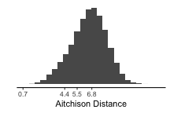

`r knitr::opts_chunk$set(cache = TRUE)`

```{r, cache = FALSE}
# In order to use these packages, we need to install flexdashboard, plotly, and Cairo.
library(tidyverse)
library(plotly)
library(spotifyr)
source('spotify.R')
```

### Indtroduction


TODO:

ADD:
picture of charlie parker + bird
  ornithology cover hhtm cover

music clip of both hhtm and orni


***

I will be analysing to the jazz standard Ornithology, first recorded by Charlie Parker. Ornithology is a refference to Parkers nickname "Bird". Jazz standards often differ from one another quite alot, yet Ornithology is one among them that is particularly well known for all the different recordings. 
One reason for this is that the jazz standard has also been recorded under another name "How high the Moon", which follows the exact same chord progression as ornithology, but is usually in a slower tempo. Because of this tempo is one of the first aspects which come to mind for analysing this standard. Obviously, some Ornithology recordings are going to be slower than some How high the moon recordings. But in essence, are there real messurable differences between recordings with the name How high the moon and Ornithology or are they really just interchangable. 
The data I am using is a playlist containing ±90 How High The Moon recordings, and ±90 Ornithology recordings. 


### Visualisation of Tempo in 'Ornithology' and 'How High the moon;

```{r}
grammy <- get_playlist_audio_features('digster.fm', '4kQovkgBZTd8h2HCM3fF31')
edison <- get_playlist_audio_features('spotify', '37i9dQZF1DX8mnKbIkppDf')
awards <-
    grammy %>% mutate(playlist = "Grammys") %>%
    bind_rows(edison %>% mutate(playlist = "Edisons"))
angry <-
    awards %>%                   # Start with awards.
    ggplot(                      # Set up the plot.
        aes(
            x = valence,
            y = energy,
            size = loudness,
            colour = mode,
            label = track_name
        )
    ) +
    geom_point(alpha = 0.8) +               # Scatter plot.
    geom_rug(size = 0.1) +       # Add 'fringes' to show data distribution.
    facet_wrap(~ playlist) +     # Separate charts per playlist.
    scale_x_continuous(          # Fine-tune the x axis.
        limits = c(0, 1),
        breaks = c(0, 0.50, 1),  # Use grid-lines for quadrants only.
        minor_breaks = NULL      # Remove 'minor' grid-lines.
    ) +
    scale_y_continuous(          # Fine-tune the y axis in the same way.
        limits = c(0, 1),
        breaks = c(0, 0.50, 1),
        minor_breaks = NULL
    ) +
    scale_colour_brewer(         # Use the Color Brewer to choose a palette.
        type = "qual",           # Qualitative set.
        palette = "Dark2"       # Name of the palette is 'Paired'.
    ) +
    scale_size_continuous(       # Fine-tune the sizes of each point.
        trans = "exp",           # Use an exp transformation to emphasise loud.
        guide = "none"           # Remove the legend for size.
    ) +
    theme_light() +              # Use a simpler theme.
    labs(                        # Make the titles nice.
        x = "Valence",
        y = "Energy",
        colour = "Mode"
    )
ggplotly(angry)
```

***

For this visualisation from Week 7, I took playlists of the pop music presented at the Grammy awards (US) and the Edison awards (NL) in 2019. Using `ggplotly`, the visualisation became interactive.

The *x* axis shows valence and the *y* axis shows Spotify's ‘energy’ feature, which is roughly analogous to the notion of arousal in psychological research on emotion. Under this model, the quadrants of each graph, starting clockwise from the top left, reprsent angry, happy, relaxed, and sad music. The size of each point is proportional to the average volume of the track.

The visualisation shows that in 2019, the pop music at the Grammys was (according to Spotify) rather angrier and rather louder than the music at the Edisons.

### different graphs of hhtm and ornithology.


***
The Histogram shows us that what I previously stated, is not actually validated by my data. It appears that there is little difference at all in tempo between the recordings labled "How High The Moon" and "Ornithology". There are even a couple of How High The Moon recordings, way faster then any other Ornithology recording in my dataset.

Besides tempo differences, one of the things that I noticed immediately, is that there is a vast difference in popularity ranging from 0 to 41. Which is quite a lot, seeing it is all actually the same song. As a refference for popularity, disneys own popular songs playlist has a popularity range of 13-74, yet in a playlist of 10X top1 disney song, the popularity is pretty much the same.
I am going to try to find an explanation for this huge popularity range by plotting it against a set of different possible causes. If a perfect correlation is found I would expect to see a graph where 'popularity vs x' gives me an straight diagonal line (y=B * x). I am not expecting to find such a perfect correlation however, as popularity will most likely be a combination of factors. 

The first obvious step is to plot popularity against tempo. 

This graph shows us a couple of interesting things. Most importantly, it shows us that there is a definite sweet spot in tempo, where the recordings are more popular. This occurs for both How High The Moon and Ornithology around 115BPM. At a slower tempo of 80BPM another spike in popularity is seen, telling us that this song is also enjoyed at a slower tempo. Another thing we can easily see from this graph is that the three extremely fast recordings of how High The Moon, already mentioned in below the previous histogram, are definately outliers in my dataset. 

There are many more ways to find some correlation for popularity. In the comming weeks I will be exploring those.


### similarity matrix and relation between hhtm and ornithology..

```{r}
tallis <- 
    get_tidy_audio_analysis('2J3Mmybwue0jyQ0UVMYurH') %>% 
    select(segments) %>% unnest(segments) %>% 
    select(start, duration, pitches)
chapelle <- 
    get_tidy_audio_analysis('4ccw2IcnFt1Jv9LqQCOYDi') %>% 
    select(segments) %>% unnest(segments) %>% 
    select(start, duration, pitches)
maria_dist <- 
    compmus_long_distance(
    tallis %>% mutate(pitches = map(pitches, compmus_normalise, 'manhattan')),
    chapelle %>% mutate(pitches = map(pitches, compmus_normalise, 'manhattan')),
    feature = pitches,
    method = 'aitchison')
```

```{r}
maria <- 
    maria_dist %>% 
    mutate(
        tallis = xstart + xduration / 2, 
        chapelle = ystart + yduration / 2) %>% 
    ggplot(
        aes(
            x = tallis,
            y = chapelle,
            fill = d)) + 
    geom_tile(aes(width = xduration, height = yduration)) +
    coord_fixed() +
    scale_x_continuous(
        breaks = c(0, 60, 105, 150, 185, 220, 280, 327), 
        labels = 
            c(
                'Ave Maria',
                'Ave cujus conceptio',
                'Ave cujus nativitas',
                'Ave pia humilitas',
                'Ave vera virginitas',
                'Ave preclara omnibus',
                'O Mater Dei',
                ''),
        ) +
    scale_y_continuous(
        breaks = c(0, 45,  80, 120, 145, 185, 240, 287), 
        labels = 
            c(
                'Ave Maria',
                'Ave cujus conceptio',
                'Ave cujus nativitas',
                'Ave pia humilitas',
                'Ave vera virginitas',
                'Ave preclara omnibus',
                'O Mater Dei',
                ''),
        ) +
    scale_fill_viridis_c(option = 'E', guide = "none") +
    theme_classic() + 
    theme(axis.text.x = element_text(angle = 30, hjust = 1)) +
    labs(x = 'The Tallis Scholars', y = 'La Chapelle Royale')
# ggsave('maria.png', maria, width = 13, height = 8, dpi = 'retina')
maria
```

***

This visualisation of two performances of the famous ‘Ave Maria’ setting of Josquin des Prez uses the Aitchison distance between chroma features to show how the two performances align with one another. 

For the first four stanzas, the relationship between the performances is consistent: the Tallis Scholars sing the piece somewhat more slowly than La Chapelle Royale. For the fifth stanza (*Ave vera virginitas*, starting about 3:05 into the Tallis Scholars’ performance and 2:25 into La Chapelle Royale’s), the Tallis Scholars singing faster than La Chapelle Royale, but at the beginning of the sixth stanza (*Ave preclara omnibus*, starting about 3:40 into the the Tallis Scholars’ performance and 3:05 into La Chapelle Royale’s) the Tallis Scholars return to their regular tempo relationship with La Chapelle.

Although the interactive mouse-overs from `ggplotly` are very helpful for understanding heat maps, they are very computationally intensive. Chromagrams and similarity matrices are often better as static images, like the visualisation at left.

Static images can sometimes also be useful to add content to your commentary, like the histogram of Aitchison distances below, labelled with the minimum, first quartile, median, third quartile, and maximum values in the data. You must save the images manually, however, and make sure to export them at a good size.

```{r}
maria_hist <- 
    maria_dist %>% 
    ggplot(aes(x = d)) +
    geom_histogram(binwidth = 0.5) +
    theme_classic() + 
    theme(
        axis.line.y = element_blank(), 
        axis.ticks.y = element_blank(),
        axis.text.y = element_blank()) +
    scale_x_continuous(breaks = c(0.7, 4.4, 5.5, 6.8, 14.2)) +
    labs(x = 'Aitchison Distance', y = '')
ggsave("maria_hist.png", maria_hist, width = 3, height = 2, dpi = 'screen')
```

